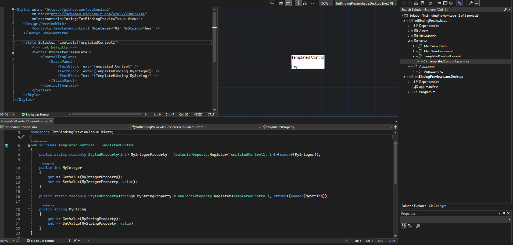

### Issue

Previewer doesn't preview correctly a `StyledProperty` of type `int` when used in a `TemplateBinding` (but it works for a `string` property).

On this picture, the previewer should render `42` in the middle row but the row is empty:

### To reproduce

Clone the code and open the `TemplateControl1.axaml` file with the previewer.

### Versions

**Avalonia** 11.0.2

**Visual Studio** Microsoft Visual Studio Community 2022 (64-bit) - Preview, Version 17.7.0 Preview 1.0

**Avalonia for Visual Studio 2022** 0.10.18.4